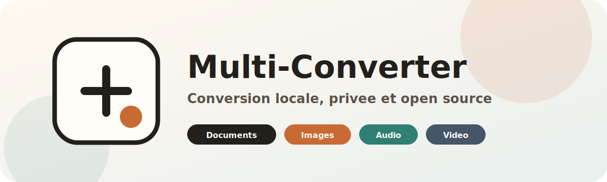
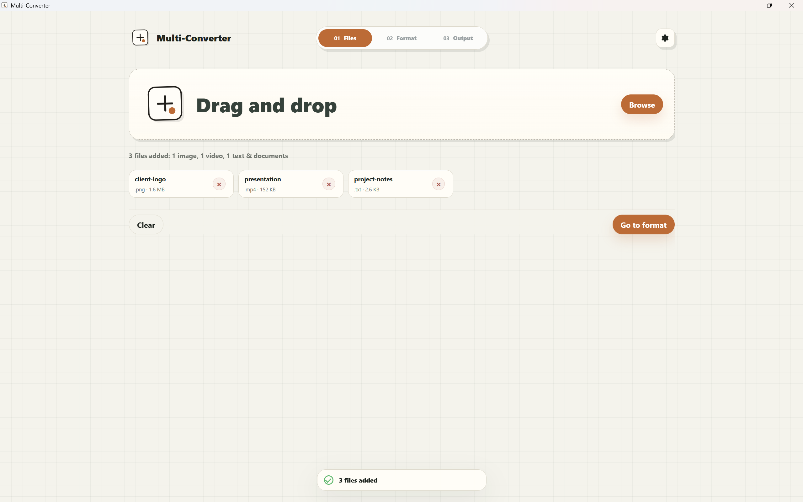
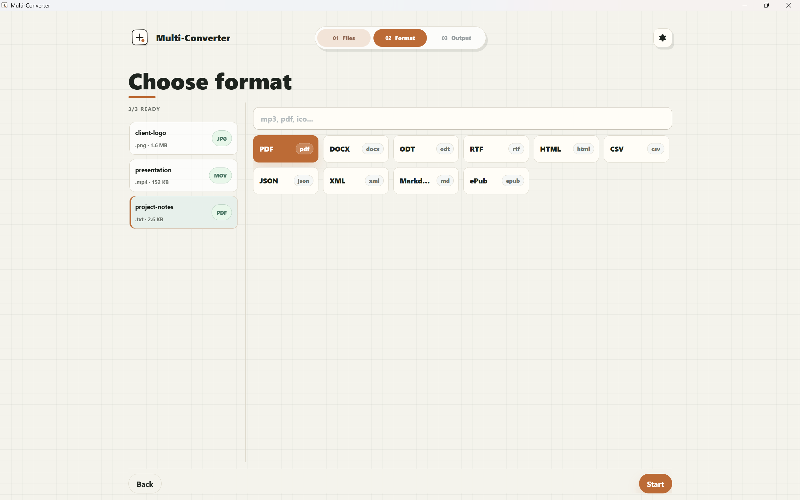
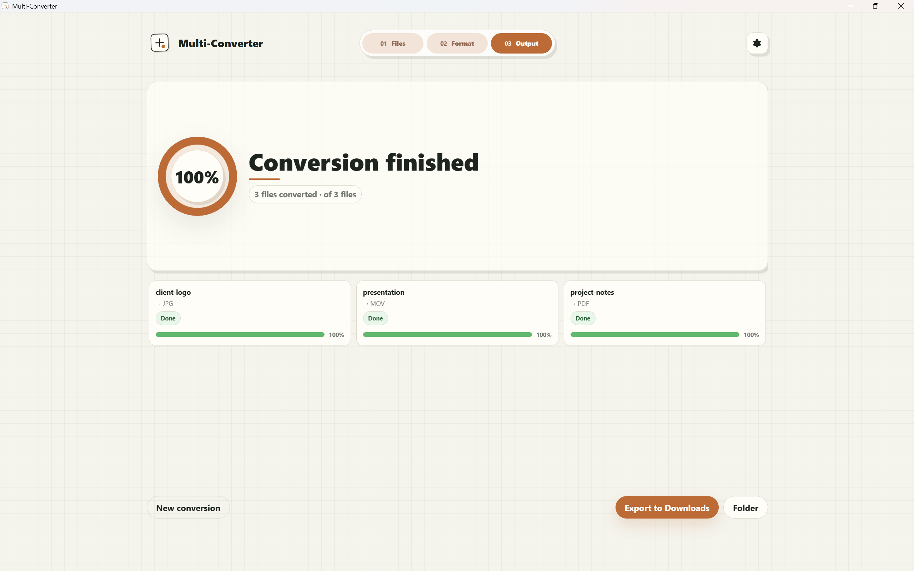

# Multi-Converter

<p align="center">
  
</p>

<p align="center">
  <a href="https://github.com/Amix29/Multi-Converter/releases/latest">
    
  </a>
  <a href="https://github.com/Amix29/Multi-Converter/actions/workflows/build.yml">
    
  </a>
  <a href="LICENSE">
    
  </a>
</p>

<p align="center">
  <strong>Multi-Converter</strong> is a <strong>free</strong> and <strong>open source</strong> tool to convert your files directly on your computer.<br>
  Documents, images, audio and video — no account, no cloud, no file upload to any server.
</p>

<p align="center">
  <a href="https://github.com/Amix29/Multi-Converter/releases/latest/download/Multi-Converter_windows-x64_setup.exe">
    
  </a>
</p>

---

## Table of Contents

- [Why use Multi-Converter?](#why-use-multi-converter)
- [Download](#download)
- [Overview](#overview)
- [Supported Formats](#supported-formats)
- [Privacy](#privacy)
- [Maximum Quality Extension](#maximum-quality-extension)
- [Licenses](#licenses)
- [Legal Notice](#legal-notice)
- [Development](#development)
- [Contributing](#contributing)
- [Code of Conduct](#code-of-conduct)
- [Security](#security)
- [Star History](#star-history)

---

## Why use Multi-Converter?

| Key point | What it means for you |
| --- | --- |
| 🆓 **Free and open source** | Use **Multi-Converter** freely and browse its source code. |
| 🔒 **Local and private** | Your files stay on your computer throughout the conversion. |
| 🔄 **Multi-format** | Documents, images, audio and video — all handled in a single app. |
| ⚡ **Optional advanced mode** | The **Maximum Quality** extension adds specialized engines for complex conversions. |

---

## Download

| System | Status | Download |
| --- | --- | --- |
| 🪟 Windows x64 | ✅ Available | [`.exe`](https://github.com/Amix29/Multi-Converter/releases/latest/download/Multi-Converter_windows-x64_setup.exe) |
| 🍎 macOS | 🚧 In development | Not yet available |
| 🐧 Linux | 📋 Planned | Not yet available |

---

## Overview

<p align="center">
  
  
  
</p>

---

## Supported Formats

**Multi-Converter** detects the formats listed below and offers compatible conversions based on the available engines.

| Category | Recognized formats |
| --- | --- |
| 📄 Documents & text | PDF, DOCX, TXT/LOG, HTML/HTM, CSV, JSON, ODT, RTF, Markdown/MD, EPUB, XML |
| 🖼️ Images | PNG, JPEG/JPG, SVG, WebP, TIFF/TIF, BMP, ICO |
| 🎵 Audio | MP3, AAC/M4A, FLAC, WAV, OGG/OGA, WMA, OPUS, AIFF/AIF, ALAC, AC3, MP2, AMR, AU/SND, CAF |
| 🎬 Video | MP4/M4V, MKV, WebM, MOV, AVI, WMV, 3GP/3G2, MTS/M2TS, MPEG-2/MPG/MPEG, OGV |

> **Note**
> Some formats may be recognized without supporting every possible conversion to every other format. The options shown in the app depend on the source file and the available engines.

---

## Privacy

Conversions run on **your machine**. An internet connection may be required to download the app, install an update, or retrieve the optional **Maximum Quality** extension, but **Multi-Converter** never sends your files to the cloud.

---

## Maximum Quality Extension

The **Maximum Quality** extension downloads third-party engines to improve **Office**, **PDF**, **Markdown/HTML/EPUB** and **advanced image** conversions.

*Full Windows x64 installation as declared in the manifest, sizes rounded:*

| Engine | Mainly used for | Download | Once installed | License |
| --- | --- | ---: | ---: | --- |
| PDFium | PDF to image rendering | 5.6 MB | 13.1 MB | BSD-3-Clause |
| LibreOffice headless | Accurate Office and PDF conversions | 483.8 MB | 1.51 GB | MPL-2.0 |
| Pandoc | Markdown, HTML, EPUB, DOCX | 40.7 MB | 231.1 MB | GPL-2.0-or-later |
| libvips | Advanced images | 10.8 MB | 28.5 MB | LGPL-2.1-or-later |
| **Total** | Full extension | **540.9 MB** | **1.79 GB** | Multiple licenses |

> **Note**
> You can keep only the base conversions if you don't need these advanced engines.

---

## Licenses

**Multi-Converter**'s code is licensed under the **GNU Affero General Public License v3.0 or later** (`AGPL-3.0-or-later`). See [LICENSE](LICENSE).

**Multi-Converter** uses third-party conversion engines that retain their own licenses, notices and redistribution conditions. They do not change license because you use them through **Multi-Converter**.

Key points:

- **Multi-Converter** itself is licensed under **AGPL-3.0-or-later**.
- Third-party engines remain separate software with their own licenses.
- The **Windows x64 V1** release bundles **FFmpeg** and **ffprobe** `8.1.1-essentials_build-www.gyan.dev`, built with `--enable-gpl`: the bundled executables are treated as third-party software covered by the GPL in this distribution.
- The **Maximum Quality** extension may install **PDFium**, **LibreOffice**, **Pandoc** and **libvips**, each under their own license.

See [NOTICE](NOTICE) and [docs/THIRD_PARTY_ENGINES.md](docs/THIRD_PARTY_ENGINES.md) for details.

---

## Legal Notice

*This documentation is not legal advice. Release maintainers must verify the exact obligations of the binaries and third-party engines they distribute.*

---

<h2 id="development" align="center">Development</h2>

This section is for anyone who wants to run the project locally, fix a bug, suggest an improvement, or explore the code. **Releases, installers, engine archives and release notes are prepared by the project maintainers.**

### Tech Stack

| Layer | Technology |
| --- | --- |
| Desktop application | Tauri 2 |
| UI | React + TypeScript |
| Backend | Rust + Cargo |
| Frontend build | Vite |
| Internal scripts | Node.js |

### Prerequisites

- Windows x64 for developing the currently supported version.
- Node.js `>=24 <25` and npm `>=11 <12`.
- Rust and Cargo.
- The [Tauri prerequisites for Windows](https://v2.tauri.app/start/prerequisites/).

### Project Setup

```bash
git clone https://github.com/Amix29/Multi-Converter.git
cd Multi-Converter
npm install
```

### Running the App

```bash
# Full desktop app: Tauri, real conversions, sidecars
npm start

# Equivalent command
npm run tauri:dev
```

> `npm run dev` only starts the Vite frontend with a simulated API. To test **real conversions**, **sidecars**, the **Tauri** runtime or file system access, use `npm start` or `npm run tauri:dev`.

### Useful Commands

Recommended checks before a pull request:

```bash
npm run check
npm run test:rust
npm run test:pdfium-wrapper
```

`npm run check` covers installer asset generation, base engine validation, embedded manifest validation, i18n validation, TypeScript typechecking and engine packaging validation.

Targeted commands useful during development:

```bash
npm run typecheck
npm run validate:i18n
npm run validate:embedded-manifest
npm run validate:bundled-base-engines
npm run validate:engines
```

Build:

```bash
npm run build
npm run tauri:build
```

Rust formatting and linting:

```bash
npm run fmt:rust:check
npm run clippy:rust
npm run clippy:pdfium-wrapper
```

On Windows PowerShell, direct Cargo commands can also use a temporary build folder:

```powershell
cargo fmt --manifest-path src-tauri/Cargo.toml
cargo test --manifest-path src-tauri/Cargo.toml --target-dir "$env:TEMP\mc-cargo-target-engine-registry"
```

`npm run tauri:dev` and `npm run tauri:build` use a temporary `CARGO_TARGET_DIR` to avoid stale Tauri artifacts in `src-tauri/target`.

### Project Structure

```text
src/                         React UI
src/i18n/                    UI translations
src-tauri/                   Tauri/Rust backend
src-tauri/binaries/          Base sidecars bundled for Windows x64
src-tauri/engines-manifest.json
docs/                        License, security and third-party engine documentation
tools/                       Engine technical configuration
scripts/                     Build, validation and maintenance scripts
```

Generated folders (`dist`, `node_modules`, build caches, local engine sources, engine archives, test results) must not be committed.

### Conversion Engines

**Multi-Converter** works with two engine tiers:

| Tier | Role | Distribution |
| --- | --- | --- |
| Base | Common conversions available with the app | Integrated engines or bundled sidecars |
| Maximum Quality | More accurate or more advanced conversions | Optional archives distributed separately |

The Windows x64 base engines `ffmpeg` and `ffprobe` are bundled in `src-tauri/binaries` and validated before each build.

Restore and validate the base engines:

```bash
npm run prepare:bundled-base-engines
npm run validate:bundled-base-engines
```

To work locally on engine scripts, place temporary sources under:

```text
engine-sources/windows-x64/<engineId>/
```

> **Important**
> Do not commit generated archives, local engine sources, release checksums or engine version changes without explicit approval from a maintainer.

See [tools/ENGINE_PACKAGING.md](tools/ENGINE_PACKAGING.md) and [docs/THIRD_PARTY_ENGINES.md](docs/THIRD_PARTY_ENGINES.md) for technical context.

---

## Contributing

Contributions are welcome. Read [CONTRIBUTING.md](CONTRIBUTING.md) before opening a pull request.

Expected contributions include **bug fixes**, **optimizations**, **UI improvements**, **translations**, **tests** and **feature suggestions**. Before submitting a change, run the checks relevant to the area you modified.

---

## Code of Conduct

Multi-Converter is an open source project. Everyone is expected to participate with respect, clarity and good faith.

### Expected Behavior

- Be respectful and welcoming to contributors of all experience levels.
- Keep discussions constructive, technical when possible, and focused on the project.
- When reporting a bug, include what happened, what you expected, and how to reproduce it.
- When reviewing code, focus on the change, the behavior, and concrete improvements.

### Unacceptable Behavior

- Harassment, insults, discriminatory language, personal attacks or threats.
- Spam, repeated off-topic messages, advertising, or low-effort comments that disrupt the project.
- Deliberately misleading reports, hostile reviews, or behavior intended to waste maintainer time.
- Sharing private information without permission.

### Enforcement

Maintainers may edit, hide or remove comments, close discussions, or block users when behavior harms the project or its contributors.

---

## Security

To report a vulnerability or security issue, open a **GitHub issue**. See [SECURITY.md](SECURITY.md) for scope and what information to include.

---

## Star History

[](https://www.star-history.com/#Amix29/Multi-Converter&Date)
